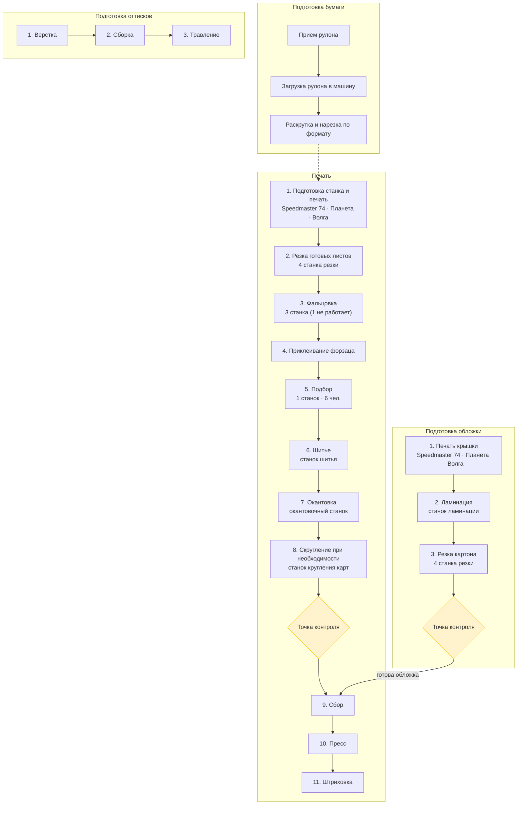

# Техпроцесс печати

Четыре независимых процесса: подготовка бумаги, печать, подготовка обложки, подготовка оттисков.

Полный реестр оборудования — в [станки.md](станки.md).

## Ментальная карта

```mermaid
flowchart TB
    ROOT((Техпроцесс печати))

    ROOT --> PB
    ROOT --> PE
    ROOT --> PO
    ROOT --> PT

    subgraph PB["Подготовка бумаги"]
        PB1["Прием рулона"]
        PB2["Размотка очереди"]
        PB2a["Загрузка рулона в машину"]
        PB2b["Раскрутка"]
        PB2c["Нарезка по формату"]
        PB1 --> PB2 --> PB2a --> PB2b --> PB2c
    end

    subgraph PE["Печать"]
        PE1["1. Печать: подготовка станка и печать<br/>Speedmaster 74 · Планета · Волга"]
        PE2["2. Резка готовых листов<br/>4 станка резки"]
        PE3["3. Фальцовка<br/>3 станка (1 не работает)"]
        PE4["4. Приклеивание форзаца"]
        PE5["5. Подбор<br/>1 станок · 6 чел."]
        PE6["6. Шитье<br/>станок шитья"]
        PE7["7. Окантовка<br/>окантовочный станок"]
        PE8["8. Скругление<br/>станок кругления карт"]
        PE9{"Точка контроля"}
        PE10["9. Сбор"]
        PE11["10. Пресс"]
        PE12["11. Штриховка"]
        PE1 --> PE2 --> PE3 --> PE4 --> PE5 --> PE6 --> PE7 --> PE8 --> PE9 --> PE10 --> PE11 --> PE12
    end

    subgraph PO["Подготовка обложки"]
        PO1["1. Печать крышки<br/>Speedmaster 74 · Планета · Волга"]
        PO2["2. Ламинация<br/>станок ламинации"]
        PO3["3. Резка картона<br/>4 станка резки"]
        PO4{"Точка контроля"}
        PO1 --> PO2 --> PO3 --> PO4
    end

    subgraph PT["Подготовка оттисков"]
        PT1["1. Верстка"]
        PT2["2. Сборка"]
        PT3["3. Травление"]
        PT1 --> PT2 --> PT3
    end

    classDef control fill:#fff3cd,stroke:#ffc107,color:#333
    class PE9,PO4 control
```

## Связи между процессами

Четыре ветки идут **параллельно**, но перед **«Сбор»** (шаг 9 в печати) нужна **полная подготовка обложки**:

## Краткая структура

| Процесс | Этапы | Контроль | Зависимости |
|---------|-------|----------|-------------|
| **Подготовка бумаги** | приём → загрузка → раскрутка → нарезка | — | питает печать |
| **Печать** | 11 последовательных операций | перед сбором | сбор ждёт обложку |
| **Подготовка обложки** | печать → ламинация → резка | после резки | блокирует сбор |
| **Подготовка оттисков** | верстка → сборка → травление | — | независимый поток |

## Производительность за смену

| Этап | Производительность | Примечание |
|------|-------------------|------------|
| **Печать** (2 × Speedmaster 74) | ~15 000 листов | переналадка — **1 час** |
| **Резка** | до 15 000 листов | 4 станка |
| **Фальцовка** | до 15 000 листов | 2 работающих станка |
| **Приклеивание форзаца · подбор · шитьё** | **700–1 000 листов** | узкое место потока |
| **Окантовка · скругление · сбор · пресс · штриховка** | — | ограничены приклеиванием форзаца, подбором и шитьём |

**Узкое место:** участок приклеивания форзаца → подбор → шитьё задаёт максимальный выпуск за смену (**700–1 000 листов**). Все последующие операции не могут превысить этот объём.

## Документальные карты: станки по этапам

| Этап | Станок | Детали | За смену |
|------|--------|--------|----------|
| Печать блока / крышки | Speedmaster 74 | 2 шт.: 1996 г., 2003 г. | ~15 000 листов; переналадка 1 ч |
| Печать блока / крышки | Планета | газетная печать | — |
| Печать блока / крышки | Волга | — | — |
| Резка листов / картона | Резка | 4 станка | до 15 000 листов |
| Фальцовка | Фальцовка | 3 станка, 1 не работает | до 15 000 листов |
| Приклеивание форзаца | — | — | 700–1 000 листов* |
| Подбор | Подбор | 1 станок, 6 человек | 700–1 000 листов* |
| Шитьё | Шитьё (шитво) | 1 станок | 700–1 000 листов* |
| Окантовка | Окантовочный | 1 станок | ограничен узким местом* |
| Скругление | Кругление карт | 1 станок | ограничен узким местом* |
| Ламинация | Ламинация | 1 станок | — |
| КБС | КБС | клеевое бесшовное соединение | — |
| Перфорация | Коландр | дырки (как в календаре) | — |
| Раскрой кожи | Раскроечный | кожа для ежедневников | — |
| Кэшировка | Кэшировка | 1 станок | — |
| Нумерация | Нумерация | 1 станок | — |

\* Совместный участок приклеивания форзаца, подбора и шитья — узкое место; все последующие операции ограничены им.

Дополнительное оборудование (КБС, коландр, раскрой, кэшировка, нумерация) используется по мере необходимости в соответствующих заказах — см. [станки.md](станки.md).
